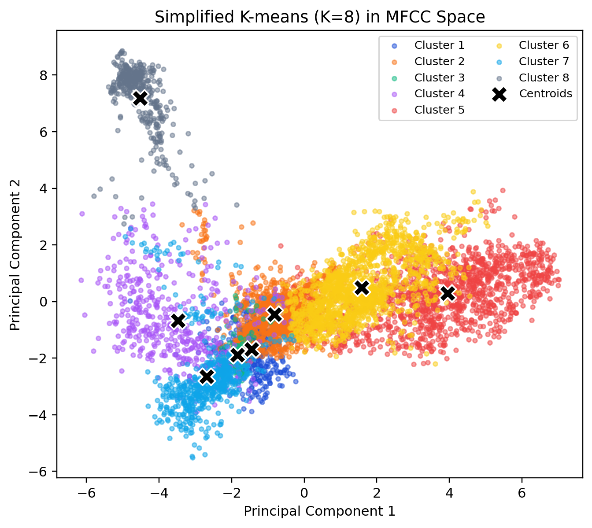

# Probabilistic Analysis of the Instrument Classifier

This document explains every stage of the bag-of-audio pipeline implemented in this repository. It focuses on the statistical ideas behind the preprocessing, vector quantization, and probabilistic prediction stages.

## 1. Signal View: Waveform and Spectrogram

We study the audio signal $x(t)$ by looking at both the raw waveform and its time-frequency energy distribution. Figure 1 visualizes a piano clip from the training set using standard signal-processing tools that make this project possible.

*Figure 1: The top panel shows the normalized waveform, and the bottom panel shows a log-power spectrogram computed using the short-time Fourier transform (STFT).*

### 1.1 Short-Time Fourier Transform (STFT)

The STFT slices the signal into overlapping windows of length $N$ samples, multiplies each slice by a window function $w[n]$, and computes the discrete Fourier transform (DFT) of each slice:

$$
X(m, k) = \sum_{n=0}^{N-1} x[n + mH] \, w[n] \, e^{-j 2\pi k n / N}
$$

where $m$ indexes the frame, $k$ the frequency bin, and $H$ the hop size. The squared magnitude $|X(m,k)|^2$ describes how much energy sits near frequency $k$ during frame $m$.

### 1.2 Mel-Spectrogram Intuition

Musical instruments are better characterized on the mel scale because our ears perceive pitch in a non-linear way: we notice small pitch differences in the low-frequency range (e.g., cello notes) but need much larger gaps to notice changes in the high-frequency range (e.g., cymbal noise). The mel scale compresses high frequencies and stretches low frequencies to mimic that perception. We approximate this by passing $|X(m,k)|^2$ through a mel filter bank $M_{r,k}$ and summing:
$$
S(m,r) = \sum_{k=0}^{N/2} M_{r,k} \, |X(m,k)|^2,
$$
where $r$ indexes one of $R$ triangular filters spaced evenly on the mel axis. Taking $10 \log_{10} S(m,r)$ yields the log-magnitude mel spectrogram shown in Figure 1.

## 2. Mel-Frequency Cepstral Coefficients (MFCCs)

The classifier uses MFCC vectors to encode each frame. The derivation is:

1. **STFT:** compute $|X(m,k)|^2$.
2. **Mel filter bank:** apply $S(m,r)$ as above.
3. **Log compression:** $L(m,r) = \log(S(m,r) + \varepsilon)$ stabilizes multiplicative energy variations.
4. **Discrete cosine transform (DCT):** project log energies into decorrelated cepstral coefficients:
   $$
   c_{m,n} = \sum_{r=1}^{R} L(m,r) \cos\left[ \frac{\pi n}{R} (r - 0.5) \right], \qquad n = 0, \dots, N_{\text{MFCC}}-1.

$$
The resulting MFCC frame $\mathbf{f}_m = (c_{m,0}, \dots, c_{m,N_{\text{MFCC}}-1})$ lies in a low-dimensional space (typically 13-20 coefficients) that captures the spectral envelope of the sound. Before any learning step the system normalizes each dimension using the training-set mean $\boldsymbol{\mu}$ and standard deviation $\boldsymbol{\sigma}$:
$$
\tilde{\mathbf{f}}_m = \frac{\mathbf{f}_m - \boldsymbol{\mu}}{\boldsymbol{\sigma} + 10^{-8}}
$$
This whitening step lets the downstream k-means algorithm treat every MFCC dimension with equal importance.

> [!important]
> **MFCC intuition.** Each coefficient summarizes how energy spreads across mel-spaced frequency regions: the lowest coefficients follow the spectral slope (distinguishing bright vs. warm sounds), while higher ones capture subtle resonances created by instrument bodies. Because these envelopes change slowly with pitch, MFCCs cluster instruments by timbre even when they play different notes, making them ideal features for the later quantization stage.

## 3. Vector Quantization via K-Means

### 3.1 Objective Function

The system clusters normalized MFCC frames into $K$ prototype vectors $\{\mathbf{c}_1, \dots, \mathbf{c}_K\}$ by minimizing the within-cluster squared error:
$$
\min_{\{\mathbf{c}_k\}} \sum_{m=1}^{M} \left\| \tilde{\mathbf{f}}_m - \mathbf{c}_{z_m} \right\|_2^2,
$$
where the assignment $z_m = \arg\min_k \| \tilde{\mathbf{f}}_m - \mathbf{c}_k \|_2^2$. The Lloyd/k-means algorithm alternates between:

- **E-step:** assign each frame to the nearest centroid (using Euclidean distance).
- **M-step:** recompute each centroid as the mean of the assigned frames.

This procedure converges to a local optimum and yields the "codebook" stored in `models/codebook.npz`. Crucially, k-means discovers centroids that summarize recurring timbral patterns across the dataset: sustained harmonic frames group near some centroids, while noisy drum hits cluster near others. By compressing thousands of MFCC vectors down to their nearest prototypes we obtain a quantization that is:

- **Compact:** only the $K$ centroid vectors need to be retained, instead of every frame.
- **Interpretable:** each centroid represents a typical spectral envelope (“audio word”).
- **Compatible with counts:** once frames are assigned to centroids we can build histograms and feed them to a multinomial model, mirroring bag-of-words text pipelines.

Without this clustering step we would not have a discrete vocabulary over which to count occurrences, and the Naive Bayes classifier would struggle to consume high-dimensional continuous MFCCs directly.

### 3.2 Visualizing the Codebook

To help intuition we project both MFCC frames and centroids to two principal components using singular-value decomposition and color each point by its assigned cluster (Figure 2).

*Figure 2: PCA projection of normalized MFCC frames (colored dots) and k-means centroids (black crosses). Each centroid defines a prototype acoustic texture.*

The centroid arrangement shows how the algorithm partitions the feature space into Voronoi cells. Frames with similar spectral envelopes share the same centroid index. This quantization step is analogous to building a vocabulary for text: each centroid acts as an “audio word” that we can count later, which is what enables the Naive Bayes model to operate on discrete evidence rather than raw continuous vectors.

## 4. Bag-of-Audio Histograms

Once we have a codebook, every clip is summarized by counting how often each centroid appears. For clip $i$ with $N_i$ frames, the histogram is
$$
 h^{(i)}_k = \sum_{m=1}^{N_i} \mathbf{1}[z_m = k], \qquad k=1,\dots,K.
$$
This is analogous to counting word occurrences in a document, hence "bag-of-audio." Harmonic instruments repeatedly visit the same subset of codewords, while percussive ones distribute counts more uniformly. The histogram preserves those coarse usage statistics while discarding ordering details, which greatly simplifies probabilistic modeling and sets up a one-to-one correspondence with the multinomial Naive Bayes classifier.

## 5. Multinomial Naive Bayes Classifier

### 5.1 Generative Story

For each instrument class $c$ we assume the following simple story (identical to the one used in beginner-friendly text classifiers):
1. Draw a class label with probability $p(c)$ - this says how common each instrument is before hearing the clip.
2. For each frame occurrence $n=1,\dots,N$, draw a codeword index $z_n$ from the class-specific distribution $\boldsymbol{\theta}_c$. These probabilities describe how frequently each “audio word” shows up inside that instrument family.

Because frames are treated as independent draws once the class is fixed, the model ends up counting how often every codeword appears, exactly like counting words in a bag-of-words document. Given a histogram $\mathbf{h}$ this produces the likelihood
$$
 p(\mathbf{h} \mid c) = \frac{N!}{h_1! \cdots h_K!} \prod_{k=1}^{K} \theta_{c,k}^{h_k}.
$$
Because the multinomial coefficient does not depend on $c$, MAP (maximum a posteriori) classification reduces to comparing log posteriors. MAP simply means we choose the class with the largest posterior probability $p(c \mid \mathbf{h})$, which balances how frequent the class is (the prior $p(c)$) with how well its codeword distribution explains the histogram (the likelihood term). Every time the histogram gains a count in bin $k$, the log score grows by $\log \theta_{c,k}$, so instruments that “expect” those codewords gain confidence quickly.
$$
 \log p(c \mid \mathbf{h}) = \log p(c) + \sum_{k=1}^K h_k \log \theta_{c,k} + \text{const}.
$$
This is Bayes' rule written in log-space: prior evidence $\log p(c)$ is added to the per-codeword log-likelihoods. The Naive Bayes assumption simply states that, once we know the instrument, the counts behave independently-an approximation that keeps the math tractable while still capturing the dominant frequency patterns.
### 5.2 Estimating Parameters with Laplace Smoothing

Let $n_{c,k}$ be the total count of codeword $k$ across all training clips belonging to class $c$. With Dirichlet($\alpha$) smoothing we obtain
$$
 \theta_{c,k} = \frac{n_{c,k} + \alpha}{\sum_{k'} (n_{c,k'} + \alpha)} = \frac{n_{c,k} + \alpha}{n_c + \alpha K}.
$$
The smoothing constant $\alpha > 0$ prevents zero probabilities for unseen codewords. Without smoothing, a single missing codeword would force $\theta_{c,k}=0$ and permanently disqualify that class. Priors are estimated by relative class frequencies:
$$
 p(c) = \frac{N_c}{\sum_{c'} N_{c'}},
$$
where $N_c$ is the number of clips with label $c$ in `Metadata_Train.csv`.

### 5.3 Log-Likelihood Computation

For numerical stability the implementation uses log probabilities. Instead of multiplying many tiny numbers, we add their logarithms, which prevents underflow and matches the linear algebra implementation. Given a histogram $\mathbf{h}$ we compute
$$
 s_c = \sum_{k=1}^K h_k \log \theta_{c,k} + \log p(c),
$$
then apply the [log-sum-exp](https://gregorygundersen.com/blog/2020/02/09/log-sum-exp/) trick to convert to normalized probabilities. Subtracting $s_{\max}$ keeps the exponentials in a safe numeric range while still producing a proper posterior that sums to one:
$$
 P(c \mid \mathbf{h}) = \frac{\exp(s_c - s_{\max})}{\sum_{c'} \exp(s_{c'} - s_{\max})}, \qquad s_{\max} = \max_c s_c.
$$
The predicted instrument is $\arg\max_c s_c$.

### 5.4 Implementation Details in This Repository

- **Sufficient statistics:** `src/train_nb.py` iterates over histogram `.npy` files, groups them by their label from `Metadata_Train.csv`, and accumulates $n_{c,k}$ into a dense matrix `counts_by_class` of shape $(C, K)$. Companion array `class_totals` holds $n_c = \sum_k n_{c,k}$.
- **Persisted parameters:** `models/nb_counts.npz` stores `counts_by_class`, `class_totals`, and `priors`. Every inference routine (`src/predict.py` or the FastAPI wrapper) loads this file, adds the Laplace pseudo-count $\alpha$ recorded in `models/meta.json`, and precomputes $\log \theta_{c,k}$.
- **Vectorized scoring:** The log-likelihood above becomes a single matrix multiplication `h[None, :] @ log_theta.T`, exactly mirroring $\sum_k h_k \log \theta_{c,k}$ but leveraging NumPy for speed.
- **Posterior interpretation:** The resulting probabilities are genuine $P(c \mid \mathbf{h})$ values for the multinomial/Dirichlet model; they can be treated as calibrated beliefs so long as the Naive Bayes assumptions approximately hold.

### 5.5 Worked Example

Imagine a toy codebook with two bins. If a histogram has $h = [3, 1]$, the guitar class has smoothed parameters $\theta_{\text{guitar},1} = 0.2$, $\theta_{\text{guitar},2} = 0.05$, and drums have $\theta_{\text{drum},1} = 0.01$, $\theta_{\text{drum},2} = 0.4$. The log scores become
$$
\begin{aligned}
s_{\text{guitar}} &= 3 \log 0.2 + 1 \log 0.05 + \log p(\text{guitar}),\\\\
s_{\text{drum}} &= 3 \log 0.01 + 1 \log 0.4 + \log p(\text{drum}).
\end{aligned}
$$
Because $\log 0.01 \ll \log 0.2$, the drum score is heavily penalized despite drum-like energy in bin 2. This arithmetic shows how multinomial Naive Bayes converts texture-frequency mismatches directly into probability penalties.

## 6. Why These Assumptions Work

- **Frame independence:** Naive Bayes assumes frames are independent and identically distributed within a class. Although not strictly true, frame dependencies mostly stem from spectral envelopes that change slowly, so the histogram still captures discriminative trends (e.g., harmonic structure vs. percussive bursts).
- **Multinomial likelihood:** MFCC codewords behave like discrete vocabulary items; instruments differ by how frequently each codeword appears (see Figure 2). The multinomial model is therefore a natural fit.
- **Laplace smoothing:** Guarantees every codeword retains a small, non-zero probability to avoid infinite negative log-likelihoods when an unseen texture appears at test time.

## 7. End-to-End Pipeline Summary

1. **Load WAV** $\rightarrow$ mono float signal.
2. **Compute MFCC frames** $\tilde{\mathbf{f}}_m$.
3. **Normalize** using stored $\boldsymbol{\mu}, \boldsymbol{\sigma}$.
4. **Assign codewords:** $z_m = \arg\min_k \| \tilde{\mathbf{f}}_m - \mathbf{c}_k \|_2$.
5. **Build histogram** $\mathbf{h}$.
6. **Score with multinomial NB** using $\theta_{c,k}$ and $p(c)$.
7. **Output prediction:** argmax of $s_c$ plus top-$k$ probabilities.

Each step relies on stored statistics (`models/codebook.npz`, `models/nb_counts.npz`, `models/meta.json`), so no retraining is needed for inference.

## 8. References for Further Study

1. Bishop, *Pattern Recognition and Machine Learning*: multinomial NB and Dirichlet priors.
